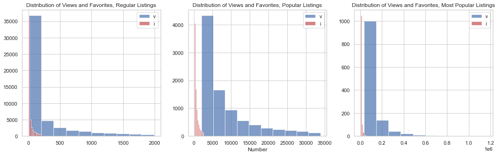

# Popularity of Etsy Listings #

## Motivation ##

What makes a product listing popular? Every online marketplace is a complex space with its own set of rules, but it's possible to gain insights by taking a look at the listing features themselves. 

This exploratory data analysis will examine the characteristics of listings on Etsy to gain an understanding of any interesting relationships that may contribute to a post's popularity. Insights could help shop owners create listings that will get the most views and favorites, eventually leading to purchase funnel conversions and increased revenue.

## Data ##

Data for listings and seller taxonomy were extracted from Etsy using the public API. A preview of the data before and after feature engineering can be found in 'fakedata.csv' and 'fakedata_beforecleaning.csv'. 

The final dataset includes features such as:
- product category
- title word count
- description word count
- tag count
- views
- favorites
- month of post creation

## Defining Popularity ##

For this analysis, popularity is defined in terms of views and favorites. A look at the histograms for both these variables shows the distributions are highly concentrated near 0 with a heavy skew to the right. To account for outliers, I used the interquartile method twice to first divide the data into regular listings and outlier listings, and then again divide the outlier listings into small outliers (popular) and big outliers (most popular).

These two are not perfectly correlated, which makes sense since a view will not always translate into a favorite. I account for this by dividing the original dataset into 6 separate dataframes, 3 for both, 1 for each level of popularity.

## EDA and Findings ##

After exploring the intial distributions and correlations of each column, I delved deeper into the data by dividing it up by product categories, month of post creation, and the text feature columns. The most interesting findings were:

Distributions of Product Categories by Popularity Level

 

Relationship between Text Length and Popularity
 

 

Seasonality of Post Creation

## Hypothesis Testing ##

Based on these findings, I wanted to run the following tests:

Null Hypothesis 1: Creating a listing in February does not lead to more views/favorites vs. other months
 
Null Hypothesis 2: The most popular listings do not have longer titles than popular listings
 
Null Hypothesis 3: Jewelry listings have the same proportion of popular listings compared to Home & Living 
 

For each of these, I chose an alpha level of 0.05, as it's reasonable to run tests on product listing data with a 1 in 20 chance of being wrong.

We can assume the data are IID as they were pulled randomly from the API.

For the first hypothesis, I ran a two sample t-test on the subset of regular listings that were created in the month of February against the rest of the months, setting the equal variance parameter to false, as the sample sizes are not the same. We reject the null with a p-value of 0 for Wiews, and an extremely tiny p-value for Favorites. The result is much more significant for favorites than for views.

Out of curiousty, I did the same for the subsets of popular/most popular listings. Interestingly enough, we failed to reject the null for all four cases. It appears that month of creation is not a factor in popularity when the listings are already highly popular. There are likely many other facotrs that caused them to become popular, and whether teh listing was created in February is not a significant one.

For the second hypothesis, I ran a two sample t-test, again setting equal variances to False. We reject the null with a p-value of 3.2062 -17.

For the third hypothesis, I ran a chi-square contigency test, which examines the relative frequencies of the two groups. The test returned a very low p-value of 7.407e -25, indicating the observed frequencies of popularity vs regular in Jewelry and Home & Living are significantly different from each other.

